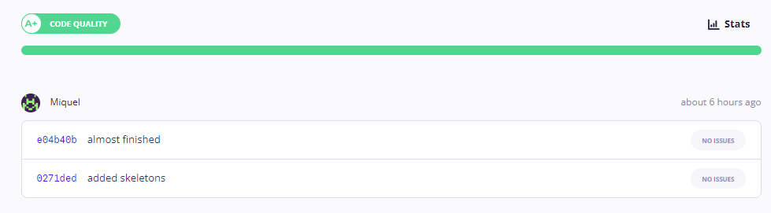
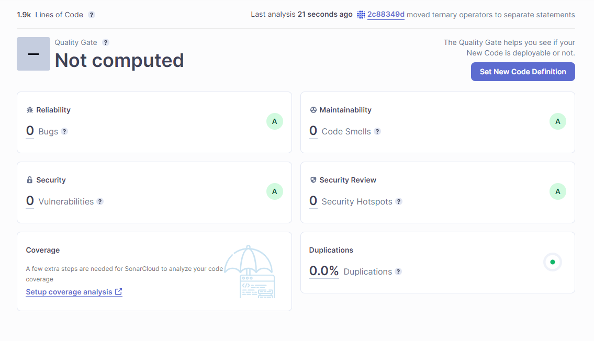

# Foodie

Foodie is a web app that allows you to search recipes and tag them as favorites. Favorite recipes are displayed in a favorites page. You can search for recipes and sort them by servings or cooking time. You can also request for a random recipe and, finally, you can search recipes based on cuisine type (Amrica, Spanish, Italian, etc.)

## Installation

Clone the repository:

```bash
git clone https://github.com/MiquelAbella/foodie.git
```

Install dependencies:

```bash
npm install
```

You have to create a .env file and store an api key from spoonacular:

API_KEY=xxxxxxxxxxxxxxxxxx

## Usage

```bash
npm run dev
```

Now the app should be running in the browser http://127.0.0.1:5173/

## Contributing

Pull requests are welcome. For major changes, please open an issue first
to discuss what you would like to change.

## Code quality

Review from CodeFactor


Review from SonarCloud


## Technologies used

- React with Vite: Is lighter and fastest than create-react-app for building a react app. React allows to reuse code splitting the code into components. One of the main advantages is tha holds a virtual dom enabling fast rendering of dynamic user interfaces. Since React is based in functional components, React offer you a collection of hooks to make the developing process easier.

- React-query: React-query is a library that allows you to fetch data in a simple and efficient way. React query caches the fetched data into a key and uses it when the return data from a fetch is the same. React-query offers built-in support for handle errors and loading states.

- TailwindCSS: TailwindCSS is becoming popular recently. Tailwind reduces the amount of css files in a project, making easy to avoid styling conflicts. In my opinion TailwindCSS make the dev process faster and easier.

## Libraries used

- React-hot-toast: Super light library to show notifications to user when interacting with the app (add to favorites, delete from favorites, etc.).

- React-icons: React icons holds a wide range of icons.

- React-router-hash-link: This library allows you to navigate through pages and scrolling into a particular section on route change.
